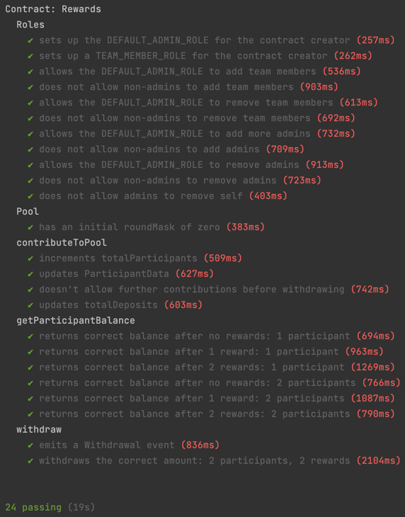

# ETHPool smart contract implementation -- Based on the EIP-1973 spec: "Scalable Rewards" (https://eips.ethereum.org/EIPS/eip-1973)

#### Deployed and verified testnet contract located at: https://ropsten.etherscan.io/address/0xe624d2d9da2b5012352286911bb7f17c2f64f304

#### Summary

This ETHPool contract allows users to deposit ETH and receive rewards proportional to their deposits in the pool. Users must be able to take out their deposits along with their portion of rewards at any time. New rewards are deposited manually into the pool by the team using a contract function.  
-   Only the team members can deposit rewards.
-   The team can deposit rewards at any time.
-   Deposited rewards go to the pool of users, not to individual users.
-   Users should be able to withdraw their deposits along with their share of rewards considering the time when they deposited. They should not get rewards for the ones distributed before their deposits.

### Local requirements:

-truffle  
-ganache (for local deployment)

### Run tests against a local Ganache network:

1. Start Ganache in Quickstart mode
2. `yarn && truffle test`
3. Test output:  
   

### Deploy to Ropsten testnet:

1. Create a .env file in the project root with the key-values found in .env.sample
2. Run `truffle deploy --network ropsten`
3. Run `truffle console --network ropsten`
4. Access the deployed contract instance: `Rewards.deployed().then(instance => instance)`
5. Try out the contract functions, for example: `Rewards.deployed().then(instance => instance.contributeToPool({ from: <your address here>, value: '500000000000000' }))`

### Verify and Publish Contract Source Code on Etherscan:

1. Generate the Standard Json-Input file: `truffle run stdjsonin Rewards`
2. Upload the generated `Rewards-input.json` file to Etherscan's Verify and Publish tool

### Query the totalDeposit balance held in the contract:

1. Run `node ./scripts/query-contract.js`

### TODO:

1. Come up with a strategy to handle dust when dealing with fractional calculations
2. Add thorough test coverage
3. A real-life contract like this would need methods for the team members to withdraw the deposited funds to spend/invest in strategies that ultimately generate the rewards

